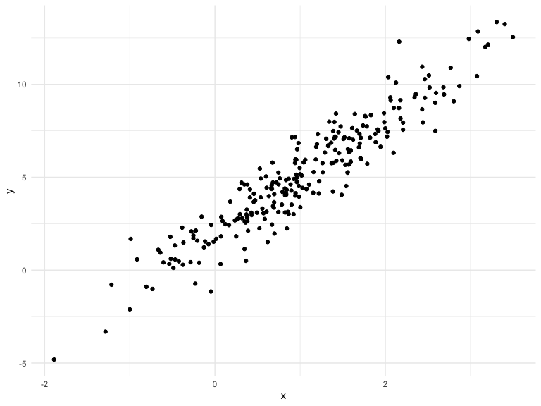
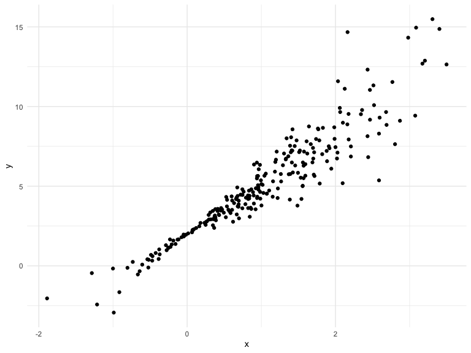
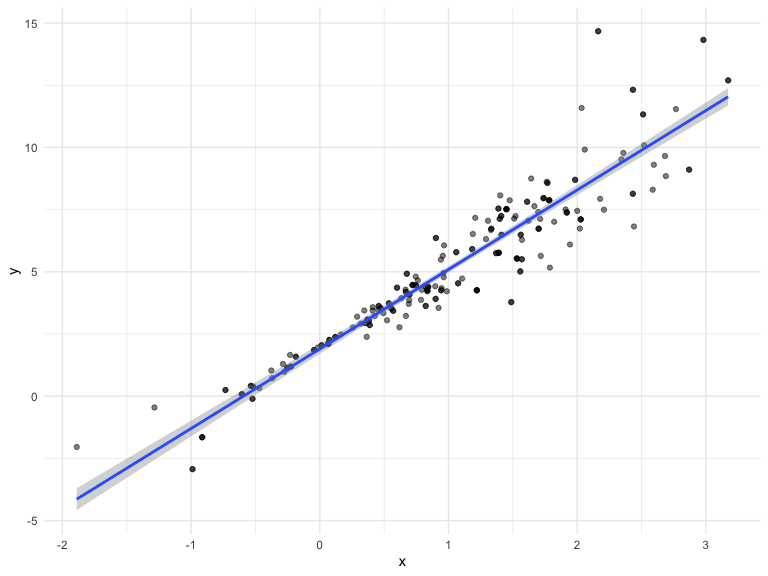
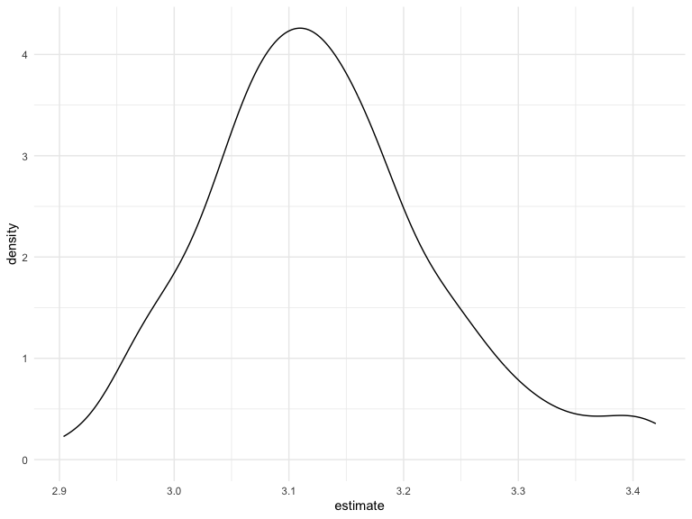
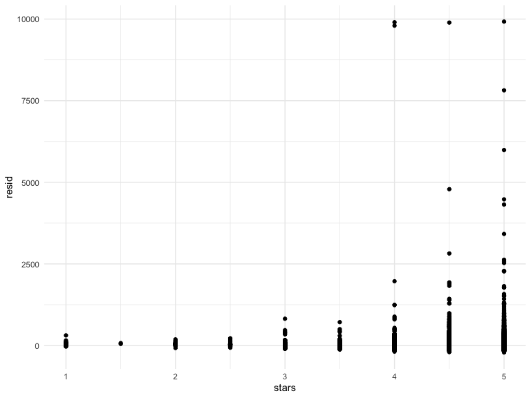
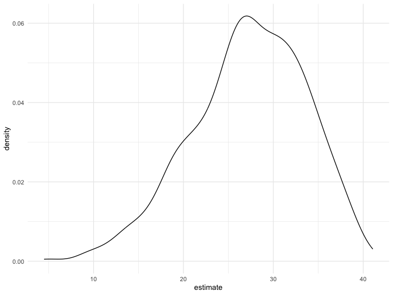

cross_validation
================
2023-11-14

## Generate a relevant example

``` r
n_samp = 250

# dataset with constant variance
sim_df_const = 
  tibble(
    x = rnorm(n_samp, 1,1),
    error = rnorm(n_samp, 0,1),
    y = 2+3 * x + error
  )

# dataset with nonconstant variance
# x value closer to 0 will have smaller error than x value far from 0 due to the error equation
sim_df_nonconst = 
  sim_df_const|>
  mutate(
      error = error *.75 * x,
      y = 2+3 * x + error
  )

sim_df_const |>
  ggplot(aes(x =x, y = y )) +geom_point()
```



``` r
sim_df_nonconst |>
  ggplot(aes(x =x, y = y )) +geom_point()
```



``` r
# variance at intercept (x=0) is low for nonconst, slop of the line should be relatively large becuase the tail is loose
```

fit some linear models

``` r
sim_df_const |>
  lm(y ~ x, data = _) |>
  broom::tidy()
```

    ## # A tibble: 2 × 5
    ##   term        estimate std.error statistic   p.value
    ##   <chr>          <dbl>     <dbl>     <dbl>     <dbl>
    ## 1 (Intercept)     1.98    0.0981      20.2 3.65e- 54
    ## 2 x               3.04    0.0699      43.5 3.84e-118

``` r
sim_df_nonconst |>
  lm(y ~ x, data = _) |>
  broom::tidy()
```

    ## # A tibble: 2 × 5
    ##   term        estimate std.error statistic   p.value
    ##   <chr>          <dbl>     <dbl>     <dbl>     <dbl>
    ## 1 (Intercept)     1.93    0.105       18.5 1.88e- 48
    ## 2 x               3.11    0.0747      41.7 5.76e-114

``` r
# for nonconst, you can't trust something coming out of lm
```

## draw a bootstrap sample

start with a lil function

``` r
boot_sample = function (df) {

  # use sample_frac(), draw a size from the dataframe of the exact size of the dataframe
  # Key step is replace = true,
  sample_frac(df, replace = TRUE)
  
}
```

Let’s see how this work

``` r
sim_df_nonconst|>
  boot_sample()|>
  ggplot(aes(x=x, y=y)) +
  geom_point(alpha = .5) +
  stat_smooth(method = "lm")
```

    ## `geom_smooth()` using formula = 'y ~ x'



## draw a lot of samples and analyze them

``` r
boot_straps = 
  tibble(strap_number = 1:100) |>
  mutate(
    strap_sample = map(strap_number, \(i) boot_sample(sim_df_nonconst))
  )

boot_straps |>
  pull(strap_sample) |>
  nth(1)|>
  arrange(x)
```

    ## # A tibble: 250 × 3
    ##         x   error       y
    ##     <dbl>   <dbl>   <dbl>
    ##  1 -1.89   1.62   -2.04  
    ##  2 -1.89   1.62   -2.04  
    ##  3 -1.21  -0.781  -2.43  
    ##  4 -1.21  -0.781  -2.43  
    ##  5 -1.00   0.832  -0.169 
    ##  6 -0.989 -1.97   -2.93  
    ##  7 -0.914 -0.908  -1.65  
    ##  8 -0.606 -0.106   0.0774
    ##  9 -0.536  0.0227  0.413 
    ## 10 -0.524 -0.536  -0.106 
    ## # ℹ 240 more rows

now do the `lm` fit.

``` r
boot_result = 
  boot_straps |>
  mutate(
    models = map(strap_sample, \(df) lm(y ~ x, data= df)),
    results = map(models, broom:: tidy)
  ) |>
  select(strap_number, results)|>
  unnest(results)
```

try to summarize these results – get a bootstrap SE

``` r
boot_result |>
  group_by(term)|>
  summarize(
    se = sd(estimate)
  )
```

    ## # A tibble: 2 × 2
    ##   term            se
    ##   <chr>        <dbl>
    ## 1 (Intercept) 0.0752
    ## 2 x           0.102

``` r
sim_df_nonconst |>
   lm(y ~ x, data = _) |>
   broom::tidy()
```

    ## # A tibble: 2 × 5
    ##   term        estimate std.error statistic   p.value
    ##   <chr>          <dbl>     <dbl>     <dbl>     <dbl>
    ## 1 (Intercept)     1.93    0.105       18.5 1.88e- 48
    ## 2 x               3.11    0.0747      41.7 5.76e-114

``` r
# compare the two dataset, the se is reversed and boot_result give us what it should, the intercept should be have smaller se than other x value. 
# if you do everything above for the constant sample, you will get matched/same result
```

look at the distribution

``` r
boot_result|>
  filter(term == "x")|>
  ggplot(aes(x = estimate)) +
  geom_density()
```



``` r
#skewed, probably because we only draw 100 bootstrap sample, try 2500
```

can I construct a CI

``` r
boot_result |>
  group_by(term)|>
  summarize(
    ci_lower = quantile(estimate, 0.025),
    ci_upper = quantile(estimate, 0.075)
  )
```

    ## # A tibble: 2 × 3
    ##   term        ci_lower ci_upper
    ##   <chr>          <dbl>    <dbl>
    ## 1 (Intercept)     1.76     1.80
    ## 2 x               2.97     2.99

## Airbnb

``` r
data("nyc_airbnb")

nyc_airbnb = 
  nyc_airbnb |>
  mutate(stars = review_scores_location / 2) |>
  rename(
    borough = neighbourhood_group) |>
  filter(borough != "Staten Island") |>
  drop_na(price, stars) |>
  select(price, stars, room_type, borough)
```

let’s fit a regression of `price` on other variables and look at
residuals

``` r
airbnb_fit =
  nyc_airbnb |>
  lm (price ~ stars + room_type + borough, data= _)
```

residuals!

``` r
nyc_airbnb |>
  modelr::add_residuals(airbnb_fit) |>
  ggplot(aes(x = stars, y = resid)) +
  geom_point()
```



run a bootstrap on this whole thing to get estimates for the effect of
`stars` on `price`

``` r
manhattan_df =
  nyc_airbnb |>
  filter(borough == "Manhattan")

boot_result = 
  tibble(strap_number = 1:1000) |>
  mutate(
    strap_sample = map(strap_number, \(i) boot_sample(manhattan_df)),
    models = map(strap_sample, \(df) lm (price ~ stars + room_type, data = df)),
    results = map(models, broom::tidy)
  )|>
  select(strap_number, results) |>
  unnest(results)

boot_result |>
  filter(term == "stars") |>
  ggplot(aes(x = estimate)) +
  geom_density()
```


